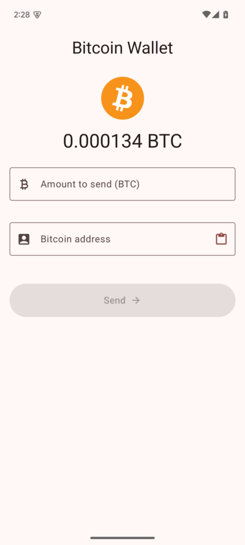
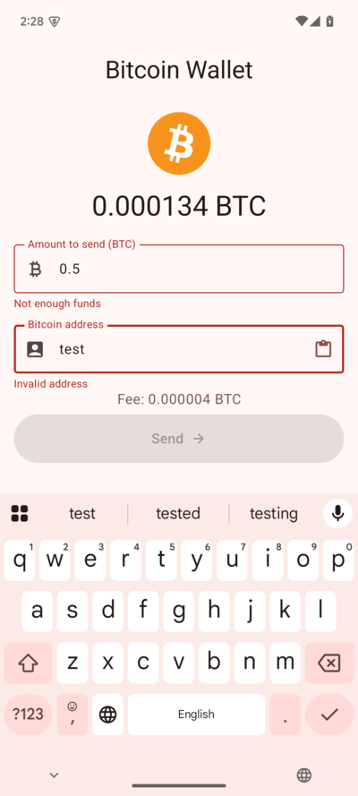
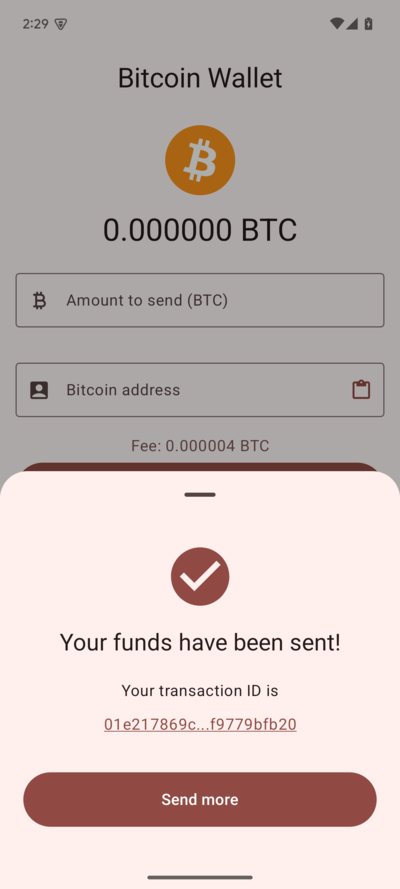

# HodlTestTask - Simple SigNet Bitcoin Wallet

[](https://github.com/RankoR/hodl-test-task/actions/workflows/android-ci.yml)
[](http://www.wtfpl.net/)

A simple, non-custodial Bitcoin wallet Android application built with modern Android development practices. This app
operates exclusively on the **Bitcoin SigNet** test network, allowing users to securely generate a key, view their
balance, and send testnet BTC.

This project was developed as a test task for HodlHodl.

## ✨ Features

* **Secure Key Management:**
* Generates a BIP39 mnemonic seed phrase upon first launch.
* Derives a BIP44-compliant Bitcoin key (P2WPKH address).
* Securely stores the mnemonic phrase using Android Keystore encryption and DataStore.
* **Wallet Operations (SigNet):**
* Displays the current wallet address.
* Fetches and displays the confirmed BTC balance from the Esplora API.
* Allows sending BTC to another SigNet address.
* Calculates estimated transaction fees based on UTXO selection and a fixed fee rate.
* Performs input validation for recipient address and amount.
* Signs transactions locally using the stored private key.
* Broadcasts signed transactions via the Esplora API.
* **User Interface:**
* Clean and simple UI built entirely with Jetpack Compose and Material 3.
* Paste button for easily entering recipient addresses.
* Displays a success dialog with a link to the transaction on a block explorer upon successful sending.
* Basic error handling and display for common issues (e.g., invalid address, insufficient funds).

## 📸 Screenshots

<p align="center">
  
  
  
</p>

## 🛠️ Tech Stack & Architecture

* **Architecture:** Clean Architecture + MVVM
* **UI:** Jetpack Compose, Material 3
* **Asynchronous Programming:** Kotlin Coroutines & Flow
* **Dependency Injection:** Hilt
* **Networking:** Ktor Client (for Esplora API)
* **Bitcoin Operations:** BitcoinJ (Key generation, HD Wallets, Transaction signing)
* **Data Persistence:** Jetpack DataStore (Preferences)
* **Security:** Android Keystore (for encrypting the stored seed phrase)
* **Logging:** Kermit
* **Testing:**
* Unit Tests: JUnit 4, MockK, Turbine
* UI Tests: Basic
* Code Coverage: Kover
* **Build System:** Gradle with Kotlin DSL & Version Catalog (`libs.versions.toml`)
* **CI/CD:** GitHub Actions (Basic build and test execution)

## 🚀 Getting Started

### Prerequisites

* Android Studio (latest stable version recommended)
* JDK 17 or higher
* Android SDK Platform corresponding to `targetSdk` in `libs.versions.toml`

### Installation (Pre-built APK)

You can download and install the latest debug APK directly from the [latest successful CI run on the
`master` branch](https://github.com/RankoR/hodl-test-task/actions?query=is%3Asuccess+branch%3Amaster++). Look for the
`debug-apk` artifact.

### Building from Source

1. **Clone the repository:**
   ```shell
   git clone https://github.com/RankoR/hodl-test-task.git
   cd hodl-test-task
   ```
2. **Open in Android Studio:**

* Select `File -> Open...` or `Open` from the welcome screen.
* Navigate to and select the cloned `hodl-test-task` directory.

3. **Sync Gradle:** Let Android Studio sync the project dependencies.
4. **Run the app:**

* Select the `app` configuration.
* Choose a target device (emulator or physical device).
* Click the `Run` button (▶️).

## 🧪 Running Tests

### Unit Tests

Execute all unit tests located in the `app/src/test` directory:

```shell
./gradlew testDebugUnitTest
```

### Android Instrumented Tests

Execute basic UI tests located in the `app/src/androidTest` directory (requires a connected device or running emulator):

```shell
./gradlew connectedDebugAndroidTest
```

### Code Coverage Report

Generate a Kover code coverage report (results will be in `app/build/reports/kover/`):

```shell
./gradlew koverHtmlReport
```

## 🚧 Future Improvements / Known Limitations

While functional for its core purpose, this app was built as a test task and has several areas for improvement:

- **Key Management:**
- - Implement mnemonic backup and recovery functionality.
- - Allow importing existing wallets/keys.
- **Wallet Features:**
- - Periodic and pull-to-refresh balance updates.
- - Display a list of past transactions.
- - More sophisticated fee estimation (e.g., fetching current network fee rates).
- - Dynamic balance precision (e.g., show 0 BTC instead of 0.00000000 BTC).
- - Display equivalent fiat value (requires price feed integration).
- - Support for different Bitcoin networks configurable at build time or runtime.
- **UI/UX:**
- - Improved error handling and user feedback.
- - Better support for various screen sizes and landscape orientation.
- - QR code scanning for recipient addresses.
- - Displaying the user's own address as a QR code.
- **Testing:**
- - Increase instrumented test coverage.
- - Implement screenshot testing for UI regression prevention.
- **Code Quality:**
- - Refine UTXO selection logic for edge cases.
- - Improve transaction size estimation accuracy.

## 📄 License

This project is licensed under the [WTFPL](http://www.wtfpl.net/)